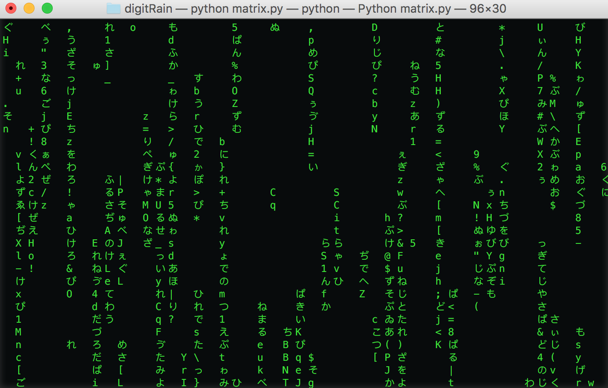
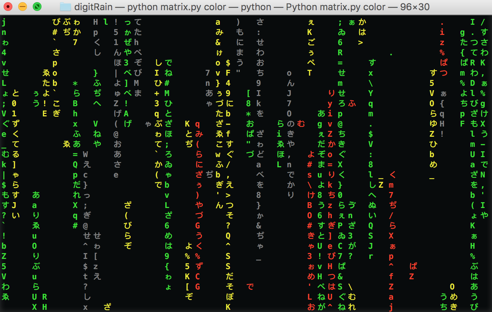
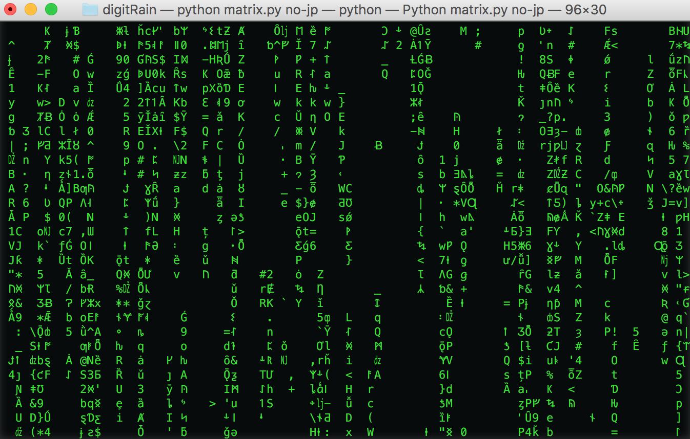

# matrixRain
Generate a matrix rain like the one in movie _matrix_ in your terminal
## Usage
1. Download the matrix.py file
2. Open your terminal and run it with python, you can turn on different effect too.
#### Default
```shell
python matrix.py
```
<p align="center"></p>

#### Colorful
```shell
python matrix.py color
```
<p align="center"></p>

#### No Japanese Characters
```shell
python matrix.py no-jp
```
<p align="center"></p>

Enjoy
